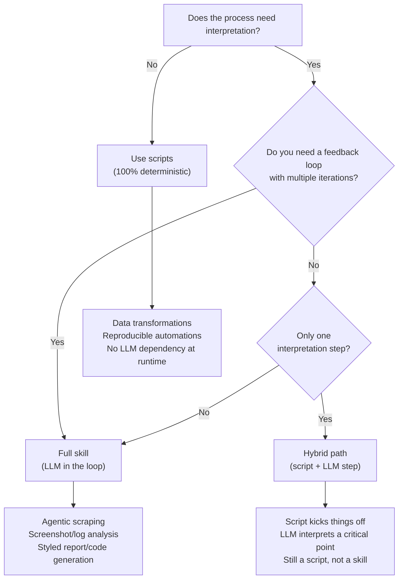

If you have doubts on when to use AI skills and when you should rather prefer
using a script this article will clear your doubts
<!--more-->

## TLDR

Use this quick flow to decide whether a skill, a script, or a hybrid makes
the most sense for your automation.

<!-- markdownlint-disable MD013 -->

<!-- markdownlint-enable MD013 -->

## When to use a skill

- You need an LLM to interpret unstructured data (natural language, images,
    multimodal inputs) inside a process that runs in a feedback loop.
- Logic depends on nuances that are hard to capture in code: agentic scraping,
    screenshot or log analysis, context-dependent decisions.
- You must teach the LLM to produce a specific output (markdown with
    guidelines, code with a house style, reports, presentations, reviews) based
    on interpreted inputs.
- You can attach references, assets, or helper scripts that the skill uses for
    the deterministic parts, all triggered from chat.

## When to use a script

- The process is deterministic and needs no interpretation.
- You want the result to avoid any LLM dependency at runtime (an agent can
    generate the script, but it should stand alone afterward).
- You care about exact reproducibility and easy debugging.

## When to use a hybrid approach

- The process is mostly deterministic but needs a one-off interpretation step
    that is not in a feedback loop.
- A script starts the flow; the LLM performs that single interpretive step and
    hands control back to the deterministic path.
- Handy for light human-like validation or disambiguating inputs before
    continuing with strict logic.

## Reminder

- A skill can orchestrate scripts and support assets to cover the deterministic
    parts. The skill remains the entrypoint whenever interpretation in the loop
    is required.

## Resources

- <https://developers.openai.com/codex/skills/>
