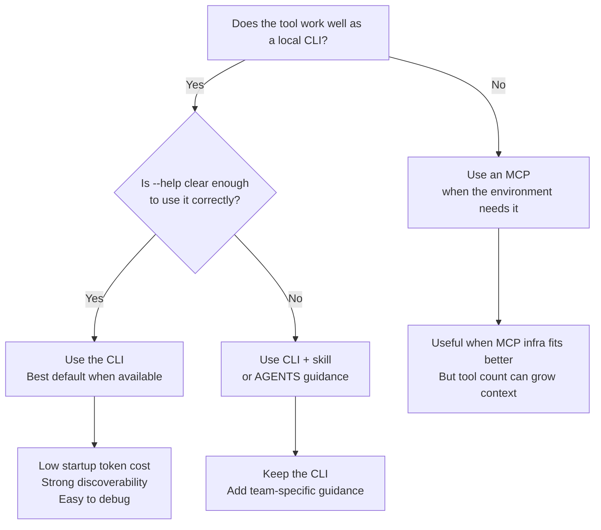

If you use AI agents for coding you will likely end up choosing between a CLI
and an MCP for the same capability. This guide is the short version of how I
think about that choice.
<!--more-->

## TLDR

Use this quick flow to decide whether a CLI, an MCP, or a CLI plus skill makes
the most sense.

<!-- markdownlint-disable MD013 -->

<!-- markdownlint-enable MD013 -->

## When to prefer a CLI

A good CLI is usually the best default when the tool is available on your
computer.

The main reason is startup cost. A well-written `--help` can explain commands,
flags, and examples without burning tokens on extra tool descriptions. In the
best case, the model can discover how to use the tool by reading the help text
and nothing else. See the
[Playwright CLI `skills-less operation` section](https://github.com/microsoft/playwright-cli?tab=readme-ov-file#skills-less-operation)
for a concrete example of one-shot execution without a required skill.

That discoverability is important on its own. If your CLI is easy to use
through `--help`, it is usually a sign that the tool itself is well designed.
Good help forces the author to make the interface clear. That is useful for
humans and useful for agents.

CLIs are also easier to inspect and debug. You can run one command, see one
result, and iterate from there.

There is also a model-selection angle here. Many current models can use the
terminal efficiently enough that CLI access becomes an advantage by itself.
This is one reason benchmarks such as [Terminal-Bench](https://www.tbench.ai/)
exist: they compare agents on terminal mastery. A model may still have weak or
inconsistent tool-use instincts, but if it is strong in the terminal, CLI can
still be the better surface.

## When to prefer an MCP

Use an MCP when the CLI is not available on your computer, or when the MCP
integration is the only practical way to expose the capability to the agent.

That does not make MCPs bad. They are useful. The problem is that they can eat
startup context fast, especially when one server exposes many tools. The more
tools the model has to keep in mind, the more likely you are to see context
rot: the tool surface becomes noisy, the important actions are harder to pick,
and the agent spends more effort deciding than doing. Auto context compaction
can make this worse because the agent may become less reliable at remembering
which MCP tool trigger it should use later in the session.

There is also a selection problem. When multiple MCPs are loaded and two tools
look similar, the model has to guess which one to call. The same thing happens
when you load too many similar skills. This is one place where `AGENTS.md` is
useful: it can disambiguate which tool or skill should be preferred in your
environment.

This is why I do not treat MCPs as a free upgrade over CLIs. They solve an
integration problem, but they also create a context-management problem.

You should also be stricter with trust. A third-party-maintained MCP is not
just a convenience layer. It is part of the agent's execution surface. If you
do not trust the maintainer, do not install it casually.

There is also a tooling boundary to keep in mind. Chat UIs such as ChatGPT may
offer connectors, which look similar to MCPs in practice, but those connectors
are usually tied to that product and are not exposed as portable integrations
you can reuse across other agent platforms. If you want to use CLIs or local
MCP servers directly, you usually need a coding agent or editor tool built for
that workflow, such as Codex CLI, Claude Code, or Cline.

## The middle ground: CLI plus skill

Sometimes the CLI is the right tool, but its help text is not enough.

That usually happens when the team uses the CLI in a very specific way that is
not obvious from the standard documentation. In those cases, `CLI + skill` is a
good compromise. The CLI stays as the execution layer, and the skill or AGENTS
guidance teaches the model how your team expects it to be used.

This is also why skills are not mandatory companions. If the tool help is clear
and in-depth, the model may not need a skill at all.

## MCP development hurdles

Developing MCP servers with the MCP SDK can get tricky because AI coding agents
usually load MCPs on startup and do not reload them until the agent is
restarted. That creates a lot of friction during development and is a big
reason tools such as MCP Inspector exist in the first place. They help, but
they are not the real thing.

My preferred model here is a hybrid tooling surface. This is my own approach,
not an industry standard. I prefer to keep the real actions as internal code
functions, then expose those same functions through a CLI, an MCP, and
optionally a REST server.

The CLI helps the agent test the actual functions while development is still
moving quickly. The MCP can then expose the same actions once it is ready for
real agent use. REST is only another exposed surface that can be enabled or
disabled at will. In this model, the CLI help can be derived from the MCP
descriptions, and the REST server can expose an OpenAPI definition built from
those same descriptions.

## Industry examples

`playwright-cli` is a good example of a CLI-first tool surface. If the help and
tool descriptions are clear, the agent can use it directly without needing a
companion skill. That is a strong pattern when the CLI is available on your
computer. In the Playwright CLI README, the authors justify it against MCP like
this:

> CLI invocations are more token-efficient.

They also explain that this avoids loading large tool schemas and verbose
accessibility trees into model context.

`playwright-mcp` can still make sense when your environment is built around MCP
infrastructure, but it comes with the usual MCP tradeoff: more tool context,
more surface area, and more chances for context rot if the server keeps growing.

`mcp2cli` is interesting because it sits in the middle. It covers the case
where an MCP capability exists, but you want to expose it through a CLI-shaped
entrypoint. That can be a practical bridge when you want the agent to consume a
tool through a simpler local command interface while still keeping the MCP as
another exposed surface.

## Conclusion

My default rule is simple.

- Prefer a CLI when the tool is available on your computer.
- Add a skill when the CLI needs team-specific guidance.
- Use an MCP when local MCP support is the better fit or the only fit.

If you can make a tool easy to discover through `--help`, do that first. It is
usually the cheapest interface for both humans and agents.

## Resources

- Model Context Protocol: <https://modelcontextprotocol.io/>
- Playwright MCP: <https://github.com/microsoft/playwright-mcp>
- mcp2cli: <https://github.com/knowsuchagency/mcp2cli>
