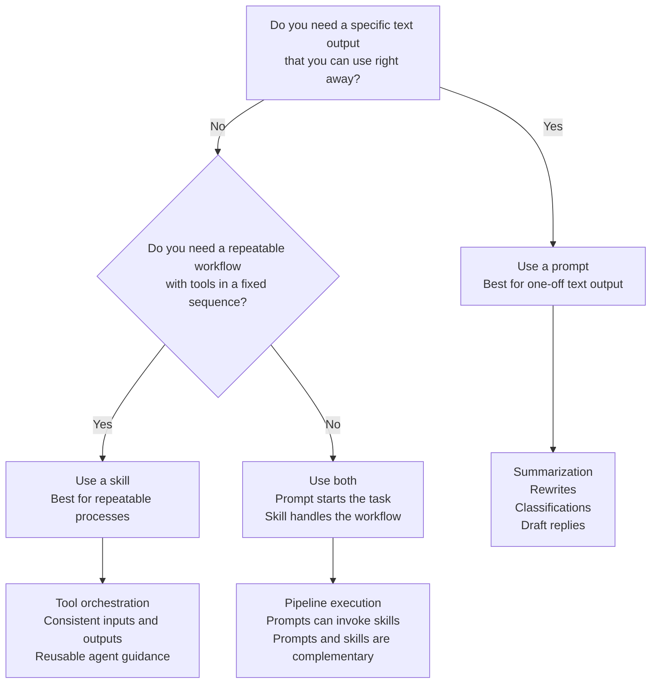

If you are building with AI, the question is often not "prompt or skill?"
but "what do I need the output to do next?" That is usually the real
decision point.
<!--more-->

## TLDR

Use this quick flow to decide whether a prompt, a skill, or both make the
most sense.

<!-- markdownlint-disable MD013 -->

<!-- markdownlint-enable MD013 -->

## When to use prompts

Prompts are the right tool when the main thing you need is text.

That usually means the model can answer directly and the result can be used as
soon as it is generated. You ask for a summary, a rewrite, a classification, a
draft email, or a short explanation, and then you use the answer immediately.

Prompts work best when:

- You want one-off text output.
- The result does not need a deterministic multi-step workflow.
- Human review happens after the model responds.
- The task is mainly about language, not orchestration.

For example, a prompt that summarizes a long meeting note is easy to reuse and
easy to evaluate. If the summary is good, you are done.

## When to use skills

Skills are better when the work is a process, not just a response.

That means the task has a clear sequence, the tools matter, and you want the
same behavior every time. The skill becomes a packaged workflow that tells the
agent what to do, in what order, and with what inputs and outputs.

Skills work best when:

- The task needs multiple steps.
- Tool usage must happen in a specific order.
- The inputs and outputs need to stay consistent.
- You want something repeatable across sessions and users.

For example, if a task needs to read files, extract fields, transform data, and
write a report in a specific format, a skill is a better fit than a standalone
prompt.

## Chat surfaces vs coding agents

From my perspective, in chat surfaces the preference is prompts.

That is because most chat products are optimized for conversational input and
single-turn or lightly guided output. You can still use structured instructions,
but a plain prompt is often the simplest and most portable choice.

In coding agents, my preference is skills.

Coding agents are a better fit for repeatable workflows because they can pair
instructions with tools, scripts, and repository-local references. That makes
skills much more useful when the agent has to do something beyond writing text.
Skills are also well suited for repeatability and for discoverability by the
agent itself, so they tend to fit coding-agent workflows better than plain
chat prompts.

If you are designing a skill for a coding agent, make the description
explicit. Include the keywords, phrases, or task patterns that should trigger
the skill automatically even when the user does not invoke it directly. In
Codex, for example, that can be reinforced with a `$skill-name` style
reference.

You should not create a skill for one-off tasks, such as generating a very
specific piece of code that you are unlikely to reuse. In that case, prompting
your way toward the solution is usually the better compromise.

There is one important caveat: not every provider exposes Skills in the same
way. Claude is the only provider I have seen supporting Skills in chat
surfaces when code execution is enabled, and it can automatically pick
relevant Skills based on the request. That is still different from a project
`SKILLS.md` file in this repository, which is a local instruction file for
coding agents.

## They can work together

Prompts and skills are complements, not competitors.

A skill can call out to prompts for parts of the workflow that are purely
textual. In practice, that means the skill handles the orchestration and the
prompt handles a narrow language task inside that process.

That pattern is useful when you want:

- A reusable workflow.
- A clear division between orchestration and generation.
- Prompts that can be shared, versioned, and reused inside multiple skills.

I like keeping reusable prompts in a skill's `references/` folder so the whole
package stays self-contained. That makes the skill easier to move, review, and
maintain.

Another example is a coding agent running inside a pipeline. My personal
approach is to still provide a prompt that defines what the agent should do,
then let that prompt invoke skills that the agent already has access to in the
pipeline. The prompt starts the work, and the skills handle the repeatable
parts of the process.

## A simple rule

My default rule is:

- Use prompts for text output that can be consumed immediately.
- Use skills for repeatable workflows that need tools and sequencing.
- Combine both when the workflow has a deterministic structure but still needs
  a model to write some of the output.

## Conclusion

If you only remember one thing, make it this: prompts are for getting an
answer, skills are for getting a process.

When the task is mostly language, start with a prompt. When the task is a
repeatable workflow, move to a skill. If you need both, use both.

## Resources

- [Agent Skills](https://agentskills.io/home)
- [OpenAI Codex Skills](https://developers.openai.com/codex/skills)
- [agents.md](https://agents.md/) as a reference only
