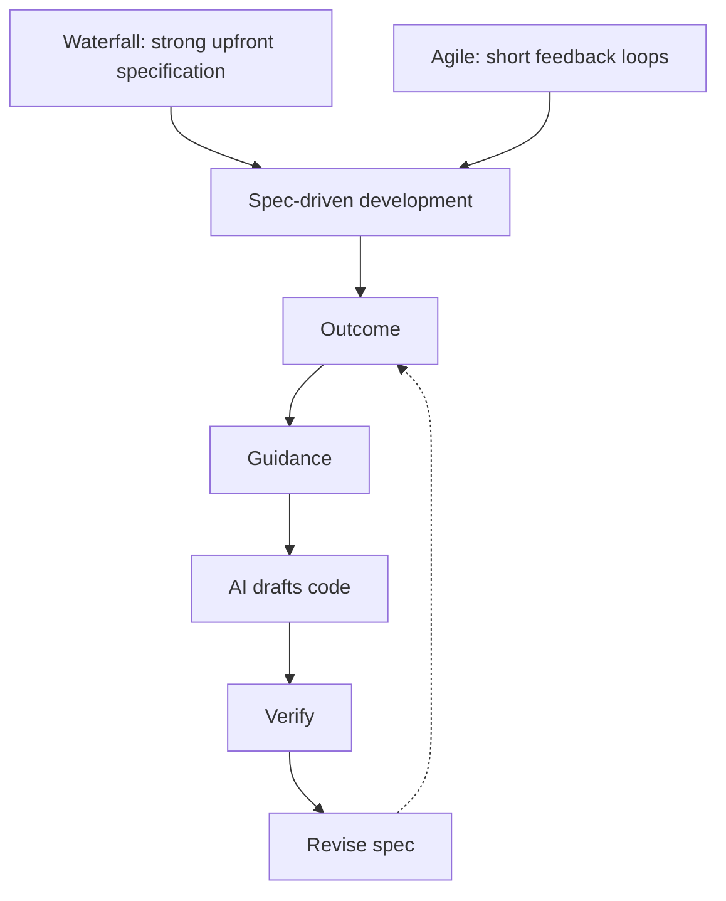

AI does not make Agile obsolete. It changes what Agile should optimize for:
less time pretending implementation effort is the whole story, more time
defining outcomes, validating AI output, and steering work with stronger specs.
<!--more-->

## TLDR

- Waterfall assumed the spec could be frozen early and then handed off for
    months of execution.
- Agile improved on that by shortening feedback loops and making change part of
    the process.
- AI changes the cost structure again. Implementation gets cheaper, so the old
    way of sizing work by coding effort becomes less useful.
- The next stage is spec-driven development: humans define the outcome, the
    constraints, and the acceptance criteria, while AI produces more of the
    code.
- Teams should measure specification quality, review effort, and decision
    quality, not story points as a rough proxy for days, which is wrong by
    Agile standards eitherway.

<!-- markdownlint-disable MD013 -->

<!-- markdownlint-enable MD013 -->

## Waterfall was a contract with uncertainty

Waterfall made one strong assumption: if the spec was clear enough at the
start, the rest of the project could be executed with limited disruption.

That worked best when requirements were stable, the system was familiar, and
the cost of change was high. In theory, the team signed up for the problem,
finished the analysis, then left people alone for months to build what had been
agreed.

In practice, that often meant the real risk was pushed into the spec itself.
If the spec was vague, incomplete, or misunderstood, the project did not drift
in a controlled way. It drifted silently until delivery exposed the gap.

So Waterfall was disciplined, but not always accurate. It protected execution
and sometimes weakened learning.

## Agile made change a first-class input

Agile was a correction to that failure mode.

Instead of assuming certainty up front, it split uncertainty into smaller
cycles. The project could be steered when it drifted away from the intended
outcome, and feedback could be used before the whole effort went off the
rails.

That was a real improvement. It made software delivery more adaptive, and it
made teams more honest about the fact that they did not know everything at the
beginning.

But Agile also encouraged a habit that made sense in the old world and becomes
less useful in the AI era: sizing work as if implementation effort were still
the dominant cost.

Story points, ticket complexity, and day-based estimates all grew out of the
same basic assumption. Human coding time was the expensive part, so planning
focused on approximating it.

That assumption is starting to break, and it was never a clean fit for Agile
either, which is wrong by Agile standards eitherway.

## AI changes the unit of work

If AI can implement a feature overnight, the old estimate is no longer
describing the real bottleneck.

That is the same shift I called out in
[Writing Code Got Cheaper. Developers Need Better AI Judgment](/2026/05/14/writing-code-got-cheaper-developers-need-better-ai-judgment/):
the scarce skill is no longer typing code, it is inspecting and constraining
what the model produces.

The bottleneck shifts from typing code to defining the outcome, giving the
model project-specific guidance, and reviewing the result. That is more
disciplined work, just at a higher level: “how precise is the spec, how well is
the model constrained, and how much review is needed to trust the result?”

## Why story points stop being a clean signal

Agile theory says story points should measure complexity, and that the team
should agree on that complexity together. Some teams avoid that by mapping story
points to days. That is wrong, but it is understandable from an Agile adoption
point of view.

Either way, both mappings are increasingly superseded. In an AI-heavy workflow,
implementation complexity is reduced by project guidance, `AGENTS.md`, skills,
and other constraints that shape the model before the code is generated.

A vague feature request may still require a lot of back-and-forth,
clarification, and correction. A well-specified ticket can now be implemented
quickly because the AI can turn the spec into code with little friction.

That means story points are no longer a reliable proxy for the actual human
work. They do not capture the quality of the guidance, the precision of the
spec, or the amount of review needed to trust the output.

## The next stage is spec-driven development

The next stage is not a return to classic Waterfall. Waterfall said: write the
spec, freeze it, and move on. Spec-driven development says something different:
write the spec carefully, feed it into a fast implementation loop, review the
output, then revise the spec when reality changes.

That is still iterative and still open to change, but it restores the
discipline that Agile sometimes lost in practice.

The strongest objection is not wrong. If you try to write an airtight spec for
an entire platform, product, or feature set before implementation starts, you
are going to miss details that only show up in the middle of the work.

That is exactly why spec-driven development should not be framed that way.
You are not writing a grand master spec for the whole system. You are writing
specs as output expectations for a ticket, a fix, or a small enhancement.

The useful unit is the loop:

- Outcome
- Guidance
- Verification mechanism

In practice, that means defining what the ticket should achieve, giving the
model the constraints it needs, and then verifying the result with the plan,
tests, or review checklist before asking for the next pass.

From my perspective, the right mental model is closer to architecture than to
ticket churn. Developers need to think in outcomes and system constraints, not
just tasks. The job is increasingly to shape the space that the model operates
in:

- project rules,
- `AGENTS.md`,
- skills,
- test expectations,
- acceptance criteria,
- and architectural boundaries.

If those inputs are precise, the model can generate code much faster and with
fewer surprises. If they are sloppy, you just get faster confusion.

Without the right guidance, AI implementation is still vibe coding. It just
gets you to the wrong answer faster.

That is the part people miss when they treat AI like a genie in a bottle.
They ask for something, the model produces something, and then they get
annoyed because the result is wrong in a way that feels almost insulting.
The problem is not that the loop exists. The problem is that the loop was not
defined well enough.

This is also why `/goal`-style workflows matter. The point is to make the model
keep working inside the loop without demanding constant reassurance from the
human. “Keep going,” “continue,” and “go ahead” are not a process. They are a
sign that the process was never structured enough in the first place.

## What teams should measure now

If AI can produce code quickly, then the valuable thing to measure is not raw
implementation speed. Measure the work that still costs humans time:

- how long it takes to produce a spec that the team trusts,
- how many review loops are needed before the output is acceptable,
- how often the model drifts away from the intended outcome,
- how much rework comes from ambiguous requirements,
- and how much decision quality improves as the team learns the system.

That is the real bottleneck now. You are not trying to measure how many lines
of code a person can produce. You are trying to measure how effectively a
person can define, steer, and validate what AI produces.

## Why team context matters more now

A lot of AI commentary is built around the solo developer. That is convenient,
but it does not scale cleanly to teams.

This also matches the point in
[Is AI Replacing Developers or Augmenting Them?](/2026/05/14/is-ai-replacing-developers-or-augmenting-them/):
AI raises throughput, but it does not remove the need for human ownership and
shared context.

An individual can keep the whole context in their head for a while. A team
cannot. Once multiple people and multiple agents are involved, shared context
becomes the limiting factor. If the project has weak process, the agents do not
fill the gap. They amplify it.

That is why project management matters more in the AI era, not less. Teams need
clearer working agreements, better specs, and better ways to keep the system of
work coherent across people and agents.

The goal is not to measure output because output is easy to fake when code gets
cheap. Measure the things that actually improve delivery:

- clarity of the project spec,
- quality of the review loop,
- strength of shared context,
- reliability of planning,
- and whether the team is getting better at turning intent into shippable work.

That is where process polish matters. Not bureaucratic polish. Operational
polish. The kind that makes project management clearer, decisions more
traceable, and team context easier to preserve as AI participates in the work.

## What Agile should keep

Agile still matters. Keep the feedback loop, drop the habit of treating coding
effort as the main unit of progress.

AI gives Agile a chance to become more disciplined, not less:

- more explicit specs,
- tighter acceptance criteria,
- faster correction,
- and better separation between thinking and drafting.

That is a better use of the framework than pretending the old estimate model
still fits.

## Final rule

AI changes Agile development by moving the center of gravity from
implementation effort to specification quality and review quality.

Waterfall froze the spec too early.

Agile opened the door to change.

Spec-driven development is the next step: keep the feedback loop, raise the
discipline, and let AI handle more of the code once the human decision-making is
clear.

## Resources

### Specification Tools

- [Spec Kit](https://github.com/github/spec-kit)
- [Open Agent Spec](https://www.openagentspec.dev/)

### Loop Tools

- [Ralph Loop](https://ralphloop.sh/)
- [Claude goal workflow](https://code.claude.com/docs/en/goal)
-
    [Follow goals with Codex](https://developers.openai.com/codex/use-cases/follow-goals)

### Guidance

- [AGENTS.md](https://agents.md/) - Project guidance for agents and humans.
- [Agent Skills](https://agentskills.io/home) - Guidance for shaping AI-assisted
    work.
- [OpenAI Codex skills](https://developers.openai.com/codex/skills) - General
    Codex skills reference for shaping output and constraints.
