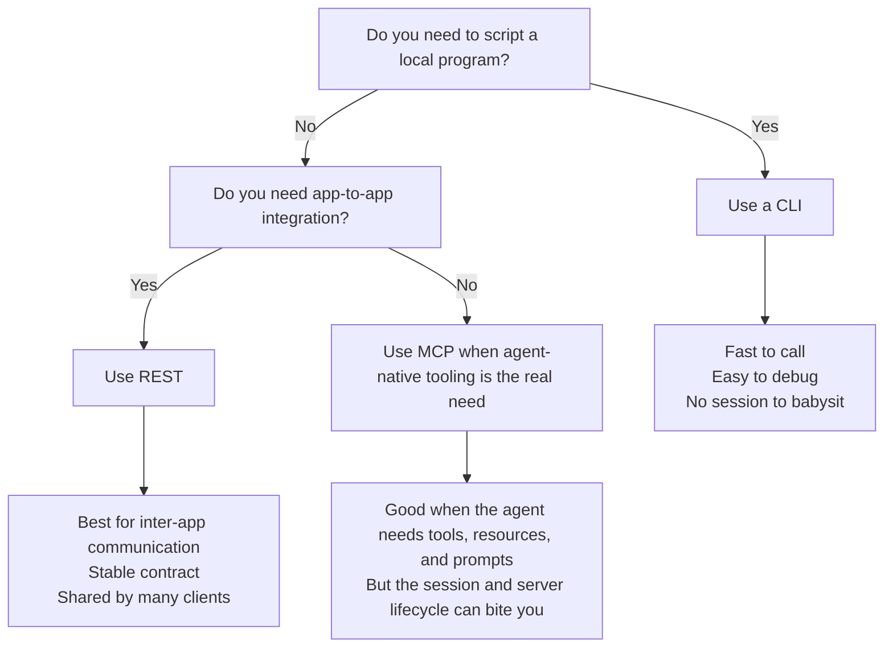

The real problem is choosing a surface that fragments the app instead of
making it easier to use.
<!--more-->

## On This Page

- [TLDR](#tldr)
- [What MCP actually adds](#what-mcp-actually-adds)
- [Why CLIs keep winning](#why-clis-keep-winning)
- [REST still matters](#rest-still-matters)
- [When MCP is worth it](#when-mcp-is-worth-it)
- [My default rule](#my-default-rule)
- [Resources](#resources)

## TLDR

Use the simplest surface that fits the job.

<!-- markdownlint-disable MD013 -->

<!-- markdownlint-enable MD013 -->

- Use a CLI when the agent is driving a local tool with rich command-line
    support.
- Use REST when the integration is between applications and the API can be
    shared.
- Use MCP when the agent needs a protocol-native tool surface and the
    operational cost is worth it.

## What MCP actually adds

MCP standardizes how a server exposes `tools`, `resources`, and `prompts` to a
client.

That is useful. It gives AI clients a common way to discover capabilities, fetch
context, and call actions without every vendor inventing its own shape. It also
folds broad APIs into task-shaped actions that are easier for a model to reason
about.

My problem is not the protocol idea. My problem is the operational tax.

In practice, a lot of MCP usage turns into this:

- the agent loads a client configuration,
- the client starts or connects to a server,
- the server assumes the initial state will stay valid,
- the session drifts,
- something external changes,
- and now you are restarting the agent because the tool surface got stale.

That is a fragile way to build a developer workflow. MCP assumes the session
state will stay valid longer than it often does. If the server depends on
internal network access, a temporary auth state, or any other condition that
can change during the session, the tool stops being trustworthy.

MCP still has work to do around server initialization and lifecycle
management. The fragile part is not the protocol itself; it is the stale
assumptions that accumulate over time when the server expects the session to
stay valid.

If an MCP layer mostly forwards to an existing API, you still pay for two
surfaces instead of one. That cost is not fatal, but it is real.

## Why CLIs keep winning

Models have gotten good at terminal work for a simple reason: the terminal is
direct.

A CLI is usually:

- call it,
- read the output,
- decide what to do next.

The important part is not that CLIs are stateless. Plenty of CLIs are stateful.
Docker, `systemctl`, and even tools built around Playwright can all manage real
state. The difference is that the state usually belongs to the application or
the local operator, not to the integration layer pretending to own the session.

That means the CLI can stay dumb while the real system keeps its own lifecycle.
You can call it again, inspect the output, and move on without asking a protocol
bridge to remember a fragile initialization contract for you.

That is why CLIs are such a strong fit for AI agents when the underlying
program already has a good command-line interface.

It is also why Playwright moved in this direction.

- `playwright-mcp` exposes browser automation through MCP for agent clients that
    want protocol-native tools.
- `playwright-cli` exposes common Playwright actions like recording, generating
    code, inspecting selectors, and taking screenshots through a command-line
    interface.

The CLI version is a cleaner fit for the kind of work agents do well when they
can inspect output directly and rerun commands without depending on an external
session manager to preserve state correctly.

That is also why terminal competence matters. Terminal-Bench exists because the
question is no longer whether models can use terminals at all, but how well
they can do it without extra glue. A year ago a lot of agents still needed
special tool-use scaffolding. Now many models can drive local programs directly,
which makes an MCP hop unnecessary for a lot of local automation.

That does not make MCP pointless. It means the benchmark now supports a more
specific claim: MCP is no longer the default integration point for every agent
task, but it still matters when it reduces the cognitive load of web API
surfaces that were never designed for agents in the first place.

## REST still matters

REST is still the shared contract when a capability needs to be exposed to
multiple apps, services, or clients.

That matters because REST is where you keep the shared rules: auth, versioning,
pagination, caching, rate limits, idempotency, and the public shape of the
capability. A CLI can stay local and direct. An MCP can stay task-shaped for
agents. REST stays the thing everyone else depends on.

That is the stack I trust more:

- the code lives in the app,
- REST exposes the app to other apps,
- CLI exposes the same logic to humans and agents on the local machine,
- MCP is an optional extra layer when an agent-specific surface actually buys
    something.

REST does not disappear because MCP exists. If anything, MCP usually depends on
REST or on the same underlying functions that REST already reaches.

## When MCP is worth it

There are real cases where MCP is the right choice.

I would use it when:

- the tool surface is shared across a team of agents,
- the server can be run as streamable HTTP and kept stable,
- the underlying app has a lot of functionality but a weak or incomplete web
    API for agent use,
- the protocol helps consolidate a lot of useful capabilities into one
    understandable interface,
- and the maintenance cost is justified by the reuse.

Think of a huge API like Slack: lots of useful primitives, but not a task-shaped
surface. MCP can be a better agent surface there because it folds those
primitives into something a model can reason about as a structured task instead
of dragging the whole web contract into context.

That last condition matters.

If the MCP server is just a thin wrapper around an app that already has a good
REST API, do not pretend you have created some new architectural category. You
have added an adapter. Adapters are fine. They are not free.

## My default rule

My default rule is blunt:

- Prefer a CLI when the tool already has a rich one and the usage stays mostly
    local and unshared.
- Prefer REST for application-to-application integration.
- Use MCP when the usage needs to be shared, agent-native, or task-shaped
    enough that folding the API is worth the extra operational cost.
- Prefer the surface that keeps the app coherent instead of splitting the same
    capability across multiple wrappers.

And if the CLI help is actually good, make it even better for agents with a
skill or repo guidance instead of bolting on another server.

That avoids stale sessions, avoids duplicate surfaces, and keeps the real logic
where it belongs: in the codebase, not in the wrapper. If that makes the MCP
camp uncomfortable, good. They should have to defend the extra layer.

## Resources

- W3C XML 1.0 Recommendation (1998):
    <https://www.w3.org/standards/history/xml/>
- SOAP 1.1 W3C Note (2000): <https://www.w3.org/TR/SOAP>
- Roy Fielding dissertation on REST (2000):
    <https://ics.uci.edu/~fielding/pubs/dissertation/fielding_dissertation.pdf>
- Model Context Protocol overview:
    <https://modelcontextprotocol.io/docs/getting-started/intro>
- MCP overview of tools, resources, and prompts:
    <https://modelcontextprotocol.io/specification/2024-11-05/basic/index>
- MCP tools: <https://modelcontextprotocol.io/docs/concepts/tools>
- MCP resources: <https://modelcontextprotocol.io/docs/concepts/resources>
- MCP prompts: <https://modelcontextprotocol.io/docs/concepts/prompts>
- Playwright MCP: <https://playwright.dev/docs/getting-started-mcp>
- Playwright CLI: <https://github.com/microsoft/playwright-cli>
